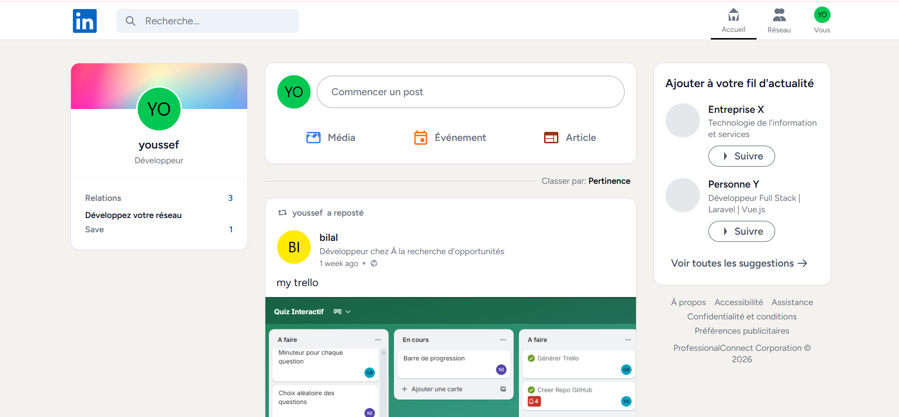
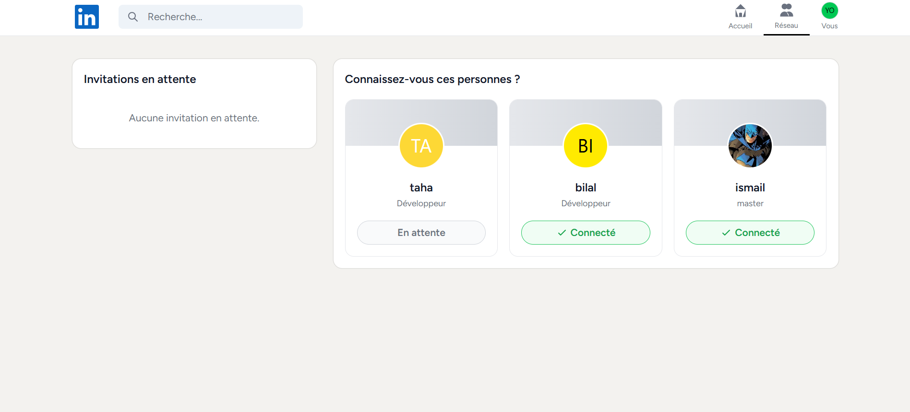
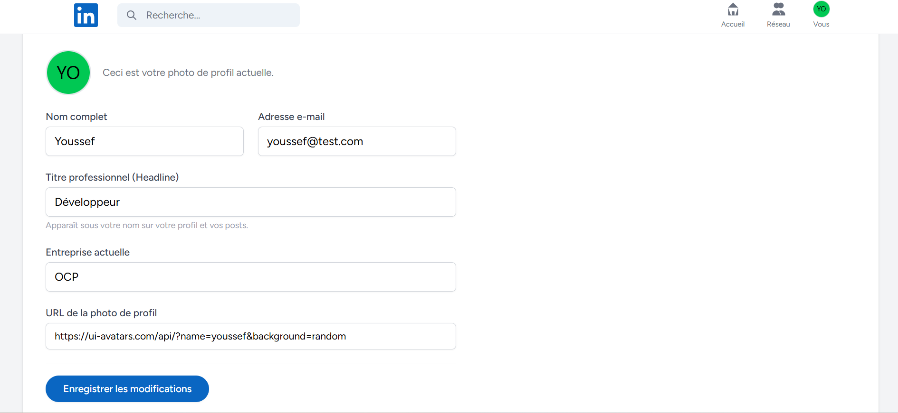

# 1. Nom du projet

**Nom du projet :** Linkup

---

# 2. Présentation du projet

Ce projet est une plateforme de réseau social professionnel qui permet de se connecter avec d'autres experts, de partager des actualités et de mettre en valeur son expérience.

Il s'adresse principalement aux travailleurs indépendants, aux étudiants et aux professionnels qui souhaitent développer leur carrière.

Son objectif principal est de faciliter le réseautage, l'échange d'opportunités et la visibilité des compétences au sein d'une communauté ciblée.

---

# 3. Problématique

Le problème identifié est que les professionnels et les chercheurs d'emploi ont souvent du mal à maintenir un réseau actif et à découvrir des opportunités dans un espace unifié et dédié exclusivement au monde du travail.

La solution proposée permet de regrouper sur une même plateforme la création d'un profil professionnel détaillé, la gestion d'un réseau de contacts (connexions) et un fil d'actualité dynamique pour partager des idées ou des réalisations.

---

# 4. Fonctionnalités principales

- Créer et gérer un profil utilisateur (titre professionnel, entreprise, photo).
- Se connecter à son espace de manière sécurisée.
- Publier des posts (textes et images) sur le fil d'actualité.
- Interagir avec les publications (aimer, commenter, sauvegarder, republier).
- Rechercher d'autres professionnels.
- Gérer son réseau (envoyer, accepter, refuser ou ignorer des invitations).

---

# 5. Technologies utilisées

| Technologie | Utilisation dans le projet |
|-------------|----------------------------|
| Laravel 12 (PHP) | Développement de l'architecture backend (MVC) et des contrôleurs |
| Blade & Tailwind CSS | Développement et stylisation de l'interface utilisateur |
| MySQL | Stockage et structuration des données relationnelles |
| Eloquent ORM | Interaction sécurisée et simplifiée avec la base de données |

---

# 6. Installation et lancement

## 6.1 Prérequis

Pour utiliser ce projet, vous devez disposer de :

- PHP 8.2 ou supérieur
- Composer
- Node.js et npm
- Un serveur local avec MySQL (ex: XAMPP, Laragon)
- Git

---

## 6.2 Cloner le dépôt

```bash
git clone [https://github.com/AITABBOUyoussef/Linkup.git](https://github.com/AITABBOUyoussef/Linkup.git)
```

---

## 6.3 Ouvrir le dossier

```bash
cd Linkup
```

---

## 6.4 Installer les dépendances

```bash
composer install
npm install
```

---

## 6.5 Variables d'environnement

Créer le fichier `.env` à partir de l'exemple :

```bash
cp .env.example .env
```

Variables de votre projet (à configurer selon votre serveur MySQL) :

```env
DB_CONNECTION=mysql
DB_HOST=127.0.0.1
DB_PORT=3306
DB_DATABASE=linkup
DB_USERNAME=root
DB_PASSWORD=
```

---

## 6.6 Lancer le projet

```bash
php artisan key:generate
php artisan migrate
npm run build
php artisan serve
```

---

## 6.7 Ouvrir le projet

Après le lancement :

```
http://localhost:8000
```

---

# 7. Captures d'écran

## Capture 1

### Titre

```
Fil d'actualité (Feed)
```

### Image

```md

```

### Explication

Cette capture montre le flux principal où les utilisateurs peuvent consulter les publications de leur réseau, aimer, commenter, republier un contenu ou en créer un nouveau.

---

## Capture 2

### Titre

```
Gestion du réseau
```

### Image

```md

```

### Explication

Cette capture montre l'interface permettant d'accepter ou d'ignorer les invitations en attente, ainsi que les suggestions de profils pour développer son réseau professionnel.

---

## Capture 3

### Titre

```
Profil Utilisateur
```

### Image

```md

```

### Explication

Cette capture montre le profil détaillé d'un membre avec ses informations (titre, entreprise, localisation) et l'historique de ses activités récentes.

---

# 8. Contribution personnelle

Ma contribution principale a porté sur le développement Full-Stack de l'application (Backend avec Laravel et Frontend avec Blade/Tailwind CSS).

J'ai également travaillé sur la modélisation de la base de données relationnelle et l'intégration du système d'authentification.

J'ai été responsable de la logique métier complexe, notamment la fusion du fil d'actualité (posts et reposts) et le système de connexion mutuelle (networking) entre les utilisateurs.

---

# 9. Difficultés rencontrées

## Difficulté 1

### Problème rencontré

Afficher un fil d'actualité (Feed) cohérent qui mélange à la fois les publications originales et les "reposts" provenant de deux tables distinctes (`posts` et `republiers`), tout en les triant chronologiquement.

### Recherches / Tests

J'ai d'abord exploré la possibilité d'utiliser des requêtes SQL brutes complexes avec des `JOIN` et `UNION`.

### Solution

J'ai utilisé les Collections de Laravel. J'ai récupéré séparément les posts et les reposts avec leurs relations chargées, j'ai mappé chaque collection pour leur donner un type commun, puis j'ai concaténé et trié le tout par date unifiée.

### Ce que j'ai appris

J'ai appris à manipuler efficacement les Collections Laravel avancées et à résoudre le problème du "N+1 queries" (chargement excessif de requêtes) pour optimiser les performances globales.

### Texte final

J'ai rencontré le problème suivant : afficher un fil d'actualité cohérent qui mélange à la fois les publications originales et les "reposts" provenant de deux tables distinctes, tout en les triant chronologiquement.

Pour comprendre l'origine du problème, j'ai exploré la possibilité d'utiliser des requêtes SQL brutes complexes avec des `JOIN` et `UNION`, mais cela rendait le code très difficile à maintenir et ne tirait pas profit de la puissance de l'ORM Eloquent.

J'ai résolu le problème en utilisant les Collections de Laravel. J'ai récupéré séparément les posts et les reposts avec leurs relations chargées (`with()`), j'ai mappé chaque collection pour leur donner un type commun (`feed_type`), puis j'ai concaténé (`concat()`) et trié le tout par date (`sortByDesc()`).

Cette difficulté m'a permis d'apprendre à manipuler efficacement les Collections Laravel avancées et à résoudre le problème du "N+1 queries" pour optimiser les performances globales de l'application.

---

# 10. Améliorations possibles

Dans une prochaine version, je pourrais :

- renforcer la sécurité et la validation des formulaires côté client avec des expressions régulières ;
- ajouter un système de notifications en temps réel (via les Events Laravel) lors des interactions ;
- intégrer une messagerie instantanée privée entre les utilisateurs connectés ;
- ajouter une section "Offres d'emploi" pour lier les recruteurs aux candidats.

### Conclusion

Ces améliorations permettraient de rendre la plateforme beaucoup plus interactive, sécurisée et attractive pour la mise en relation directe des professionnels.
